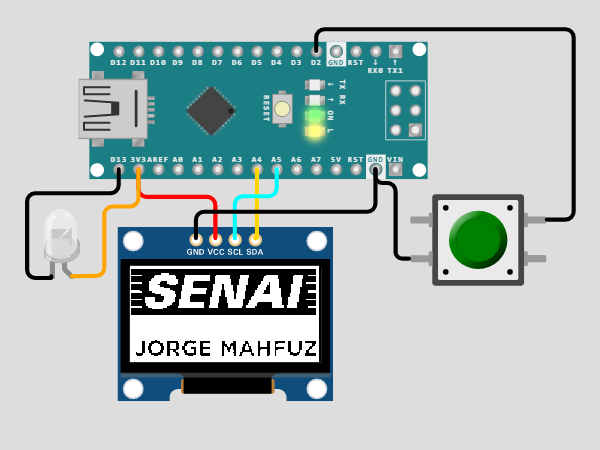
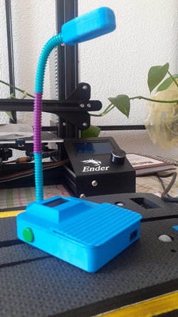
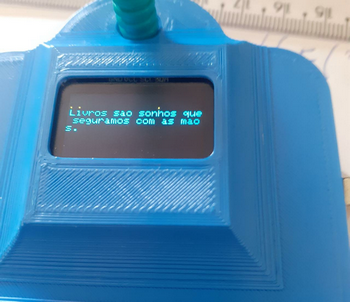
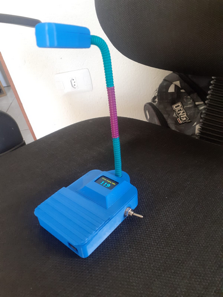

# Contador de Páginas (Semana da Biblioteca) 

Em 2022 na semana do livro, o Senai nos desafiou a criar um projeto relacionado aos tema sustentabilidade e biblioteca.
O objetivo era criar algum projeto usando habilidades maker.
Tive a oportunidade de liderar uma equipe onde criamos um produto funcional em apenas 3 dias.

> Descrição

## Ideia: 
A ideia tem como finalidade juntar a data comemorativa da semana da biblioteca junto com o tema sustentabilidade e desenvolver um acessório inteligente construído com matéria prima base garrafas pet recicladas, criando mais uma forma de mudar o destino deste plástico que seria descartado na natureza. Após converter as garrafas pet em filamento para impressora 3d através do método de extrusão esse material será usado para criar a estrutura principal do produto. 

## Função:
Sua função principal é iluminar as páginas de um livro facilitando a leitura em locais escuros e marcar a página de forma digital mostrada em um display. Este produto contará com eletrônica embarcada contendo um 1 microcontrolador (Arduino nano), 1 display oled, 1 bateria recarregável, 1 botão, fios, 3 leds e filamento 3d (reciclável)

## Funcionamento:
O Usuário (leitor do livro) vai encaixar o produto na capa do livro como se encaixa um marcador de página, sua luminária será projetada para a parte superior direcionando o raio de luz para as páginas. O display ficará logo acima do livro saindo da parte de trás onde esta encaixado, este display mostrará o numero da página atual que o leitor está lendo, junto ao display terá um botão que quando pressionado conta mais 1 na numeração mostrada, cada vez que o usuário mudar a página ele deve apertar o botão, assim como no jogo de xadrez.

## Possíveis upgrades futuros:
Adicionar um módulo bluetooth ao microcontrolador para se comunicar com o smarthphone do usuário podendo enviar a informação da pagina do livro caso o usuário queira continuar a leitura em formato digital caso tenho o livro em pdf. Com esse upgrade é possível adicionar ao display, nome do livro, comentários, lembretes ou qualquer outra informação.

## Outros produtos sustentáveis que poderão complementar o projeto:
- Recicladora de garrafa pet para filamento: Consiste em transformar a garrafa pet em filamento 3D.
 
- Carregador de bateria a manivela:  Consiste em um conjunto de engrenagem com uma manivela feitos com material de filamento reciclado, contendo um motor interno que funcionará como gerador lidado a um regulador de bateria. Que seria usado para carregar a bateria da luminária inteligente

>Grupo: 
Ezio, Larissa, Leonardo, Emerson Veiga, Andreza, Vitor

[Clique aqui para acessar](https://wokwi.com/projects/346699694177518164)

## Tecnologias

- Arduino
- Google Sketchup
- Fusion 360
- Impressão 3D
- Git e Github

## Contato
- Site: http://eziore.com.br
- E-mail: ezim10g@gmail.com
- Linkedin: https://www.linkedin.com/in/eziovieira/
